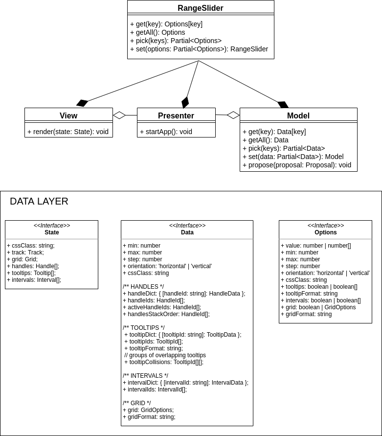

# Range Slider

Main purpose of this project is to learn the basics of:

1. typescript
2. component based design
3. mvc / mvp architecture pattern
4. observer pattern
5. testing with jest
6. property based testing with fast-check
7. basics of functional programming with ramda
8. building interactive UIs with lit-html

# Description

Range slider is a ui component for selecting numeric values from predefined range.
Value(s) can be selected by dragging handle(s).

# UML Diagram



# Demo

Range-slider in action: [https://romengrus.github.io/range-slider/](https://romengrus.github.io/range-slider/)

# Installation

1. Clone this repo

```bash
  git clone git@github.com:romengrus/range-slider.git
```

2. Install dependencies

```bash
  npm install
```

3. Run demo

```bash
  npm run demo
```

4. Open `localhost:1234` in browser

5. Run tests

```bash
  npm test
```

# Options

1. **value** Describe [Handle](#handle) positions on the [Track](#track). Each number corresponds to a [Handle](#handle) position. _(default: 50)_

- (0)-----(40)----------(100) => value: 40
- (0)---(30)-----(70)---(100) => value: [30, 70]
- (0)-(10)---(50)--(80)-(100) => value: [10, 50, 80]

2. **min** Range slider minimum value. _(default: 0)_

3. **max** Range slider maximum value. _(default: 100)_

4. **step** If provided [Handles](#handle) will move in descrete steps. _(default: 1)_

5. **orientation** Display range slider horizontally or vertically. _(default: horizontal)_

6. **cssClass** CSS class for range slider container. _(default: range-slider)_

7. **tooltips** Describe [Tooltips](#tooltip) visibility. _(default: true)_

8. **tooltipFormat** Tooltip value format. _(devault: {{number}})_ [syntax](#value-format-syntax)

9. **intervals** Describe [Intervals](#interval) visibility. _(default: [true, false])_

10. **grid** Describe [Grid](#grid) visibility/options. _(default: false)_

11. **gridFormat** Grid labels format. _(devault: {{number}})_ [syntax](#value-format-syntax)

# Value format syntax

1. numeric - {{number([sprintf format](https://github.com/alexei/sprintf.js#readme))}}

- value = 50, format = "{{number}}", result = "50"
- value = 50.3, format = "{{number(%.2f)}}", result = "50.30"

2. date - {{date([moment.js format](https://momentjs.com/docs/#/displaying/))}}

- value = 1580740934, format = "{{date}}", result = "03-02-2020"
- value = 1580740934, format = "{{date(dd-MMM-YYYY)}}", result = "Mo-Feb-2020"

# Components

## Track

Track is responsible for drawing the path withing which handles can be dragged.

## Interval

Interval is a part of track:

- between track start and first handle
- between track end and last handle
- between neighbor handles

## Handle

Handle is a ui component that can be dragged along the track path to change range slider value.

## Grid

Grid is a visual representation of the range of values along the track.

## Tooltip

Tooltip is a visual representation of handle value. It moves with handle.
